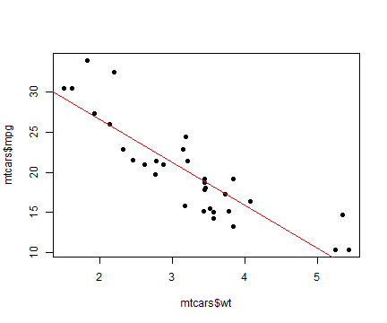
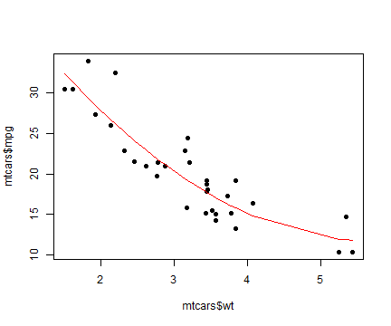

## Linear Models in R

1. the lm() command in R is used to fit linear regression models
2. Let us call the dependent variable Y and independent variable X

   The equation of the regression line is Y = aX + b
3. Sometimes, the relation between Y and X will not be exactly linear
4. So we may have to fit a more complex model
5. In this Shiny example, we fit a quadratic model (degree 2).
6. Comparing the performance of the quadratic with the linear model is informative.

---  

## Car Mileage Study

1. We use the mtcars data set in R to illustrate the point.
2. X is wt, the weight of the car. Y is mpg, the miles per gallon.

```r
data(mtcars)
plot(mtcars$wt, mtcars$mpg, pch = 19)
```

 

---

## Linear Model

1. Let us first fit a linear model. The regression line is shown in red.
3. The goodness of fit is indicated by the sum of squares of residual errors.
3. The least squares error for our linear model is 287.3.

```r
plot(mtcars$wt, mtcars$mpg, pch = 19)
abline(lm(mtcars$mpg ~ mtcars$wt), col = "red")
```

 


--- 

## Quadratic Model

1. With a degree-2 model fit, the lest squares error reduces to 203.7

```r
plot(mtcars$wt, mtcars$mpg, pch = 19)
lm1 = lm(mtcars$mpg ~ mtcars$wt + I(mtcars$wt^2))
ord = order(mtcars$wt)
lines(mtcars$wt[ord], predict(lm1)[ord], col = "red")
```

 

--- 

## The Tiny Shiny App

1. The finished Shiny application: https://ramanraja.shinyapps.io/shiny2/
2. Shiny enables the app to be interactive on the web.
3. You can choose between a linear and quadratic models.
4. Select the model on the left panel and push the button to see the effect.

Thank you !
